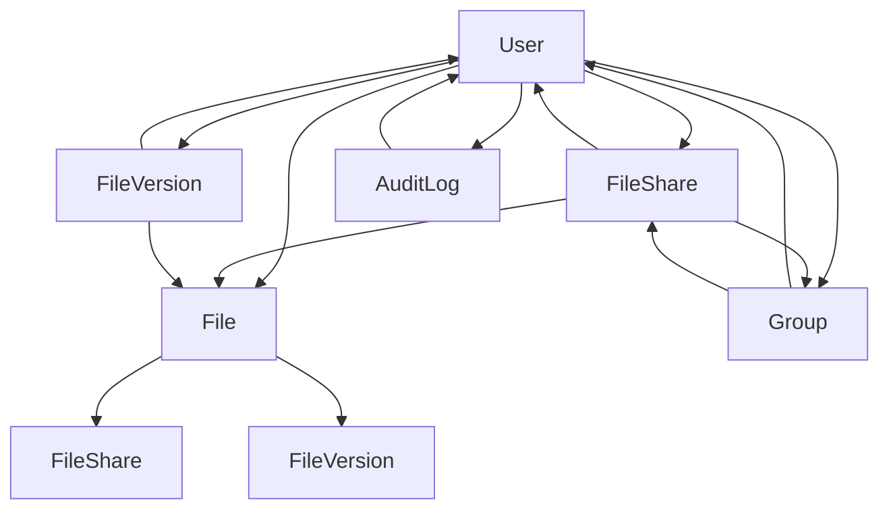

# Advanced File Sharing Schema Enhancements

## Overview
This document outlines the proposed schema changes to support advanced file sharing features including enhanced permissions, file versioning, group sharing, and improved access tracking.

## New Enums

```prisma
enum FilePermission {
  VIEW
  DOWNLOAD
  EDIT
}

enum ShareType {
  USER
  GROUP
  PUBLIC
}
```

## Updated Models

### FileShare Model Enhancements
```prisma
model FileShare {
  id              String         @id @default(cuid())
  fileId          String
  userId          String?
  groupId         String?
  sharedWithEmail String?
  shareType       ShareType      @default(USER)
  permissions     FilePermission[] // Array of permissions
  password        String?
  expiresAt       DateTime?
  maxAccessCount  Int?           // Maximum number of accesses allowed
  accessCount     Int            @default(0) // Current access count
  revoked         Boolean        @default(false)
  createdBy       String         // User who created the share
  file            File           @relation(fields: [fileId], references: [id], onDelete: Cascade)
  user            User?          @relation(fields: [userId], references: [id], onDelete: Cascade)
  group           Group?         @relation(fields: [groupId], references: [id], onDelete: Cascade)
  createdAt       DateTime       @default(now())
  updatedAt       DateTime       @updatedAt

  @@index([fileId])
  @@index([userId])
  @@index([groupId])
  @@index([expiresAt])
  @@index([revoked])
  @@index([createdBy])
}
```

### New FileVersion Model
```prisma
model FileVersion {
  id           String   @id @default(cuid())
  fileId       String
  versionNumber Int
  name         String   // Version name or description
  size         Int
  url          String   // Storage URL for this version
  changes      String?  // JSON string describing changes
  createdBy    String
  file         File     @relation(fields: [fileId], references: [id], onDelete: Cascade)
  createdAt    DateTime @default(now())

  @@unique([fileId, versionNumber])
  @@index([fileId])
  @@index([createdBy])
}
```

### New Group Model
```prisma
model Group {
  id          String   @id @default(cuid())
  name        String
  description String?
  creatorId   String
  creator     User     @relation(fields: [creatorId], references: [id], onDelete: Cascade)
  members     User[]   @relation("GroupMembers")
  fileShares  FileShare[]
  createdAt   DateTime @default(now())
  updatedAt   DateTime @updatedAt

  @@index([creatorId])
  @@index([name])
}
```

### Updated User Model
Add the following relations to the existing User model:
```prisma
model User {
  // ... existing fields ...
  groups        Group[]         @relation("GroupMembers")
  fileVersions  FileVersion[]
  createdShares FileShare[]     @relation("ShareCreator")
  // ... existing relations ...
}
```

### Updated File Model
Add the following relations to the existing File model:
```prisma
model File {
  // ... existing fields ...
  versions FileVersion[]
  // ... existing relations ...
}
```

### Enhanced AuditLog Actions
Update the AuditAction enum in `lib/audit.ts` to include:
```typescript
export enum AuditAction {
  // ... existing actions ...
  FILE_VIEW = 'FILE_VIEW',
  FILE_EDIT = 'FILE_EDIT',
  FILE_VERSION_CREATE = 'FILE_VERSION_CREATE',
  GROUP_CREATE = 'GROUP_CREATE',
  GROUP_JOIN = 'GROUP_JOIN',
  SHARE_ACCESS = 'SHARE_ACCESS',
  SHARE_EXPIRE = 'SHARE_EXPIRE',
  // ... existing actions ...
}
```

## Relationships Diagram



## Migration Considerations

### Backward Compatibility
- Existing `FileShare.permissions` string values ("view", "download") will be migrated to the new array format
- Existing shares without `createdBy` will be assigned to the file owner
- Existing audit logs remain unchanged

### Migration Steps
1. **Create new enums and models:**
   ```sql
   -- Run Prisma migration to add new tables and enums
   npx prisma migrate dev --name add-advanced-file-sharing
   ```

2. **Data migration script:**
   ```typescript
   // Migrate existing permissions
   const shares = await prisma.fileShare.findMany()
   for (const share of shares) {
     const permissions = share.permissions === 'download' 
       ? [FilePermission.VIEW, FilePermission.DOWNLOAD] 
       : [FilePermission.VIEW]
     
     await prisma.fileShare.update({
       where: { id: share.id },
       data: { 
         permissions,
         createdBy: share.file.userId // Assign to file owner
       }
     })
   }
   ```

3. **Update application code:**
   - Update permission checks to use array includes
   - Add version management logic
   - Implement group sharing UI and API
   - Enhance audit logging for new actions

### Performance Indexes
- FileShare: fileId, userId, groupId, expiresAt, revoked
- FileVersion: fileId, versionNumber
- Group: creatorId, name
- AuditLog: userId, action, resource, createdAt (existing)

### Database Constraints
- FileVersion: Unique constraint on (fileId, versionNumber)
- FileShare: Ensure either userId or groupId is set (not both null for non-public shares)
- Group: Prevent empty groups (at least creator as member)

## Implementation Notes
- Use database transactions for operations involving multiple shares/versions
- Implement cleanup jobs for expired shares and old versions
- Consider implementing soft deletes for audit compliance
- Add rate limiting for share access to prevent abuse